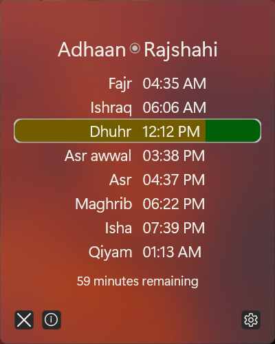

+++
title = "AdhaanGUI"
description = "A small taskbar app for showing prayer times"
weight = 10
date = 2021-10-18

[taxonomies]
tags = ["Islam", "utility", "app", "GUI", "Rust"]

[extra]
gh_repo = "RagibHasin/AdhaanGUI"
license = "AGPL-3.0"
+++

{{ infobar() }}

It is small Windows app that lives as a notification area icon and shows prayer times using [`adhaan`](../adhaan).

It is written in Rust using the [Druid](https://docs.rs/druid) GUI library. Working on this lead to my first serious foray into community contribution in the [Linebender](https://linebender.org/) community.

This project is currently on hiatus. I'm in the process of porting it to [Xilem](https://github.com/linebender/xilem), which is the successor of Druid.
